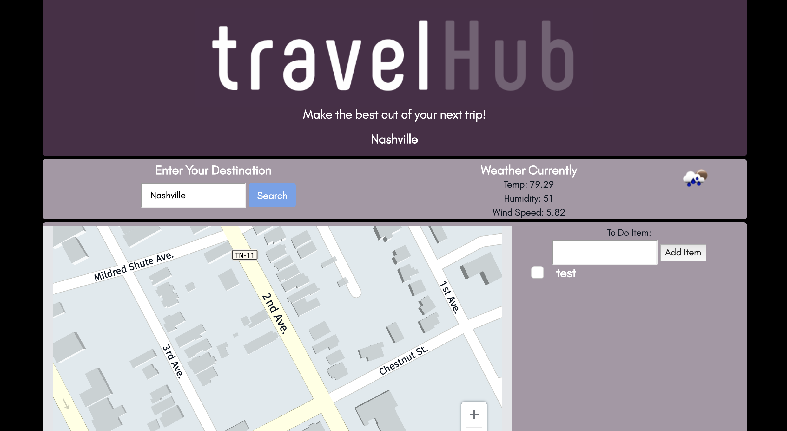
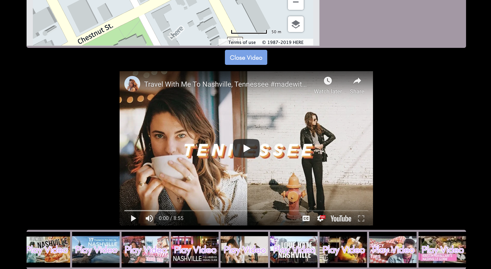

# TravelHub Project
This is the first group project for Vanderbilt's Coding Bootcamp. 

# Link 
https://jonfinley211.github.io/Project1/

## Original Inspiration
This site provides initial information for users who are planning to travel somewhere new. A to-do list is provided with local storage in order to store ideas and inspiration.

## Technology Used
- jQuery 
- 3 APIs (Here, OpenWeather, YouTube)
- animate.css library
- Bootstrap
- JSON requests

## First Half of Screen

## Second Half of Screen When 

## Future Goals
- Making a more interactive list with Google links
- Making the map more interactive 
- Additional travel APIs (SkyScanner, Booking, etc.)