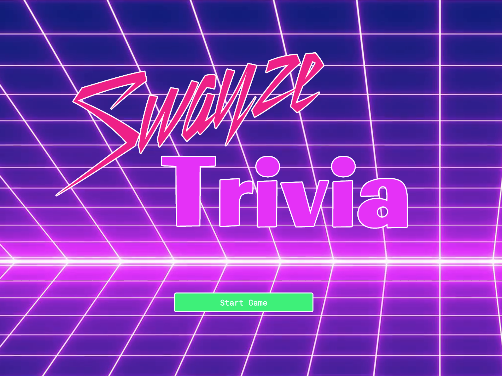
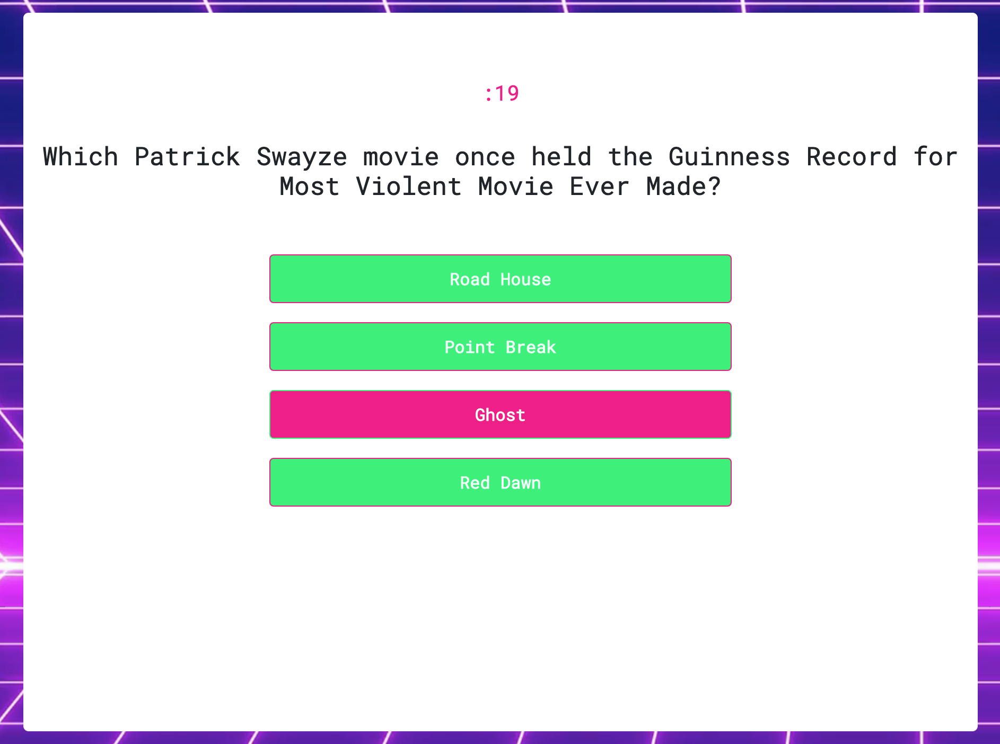
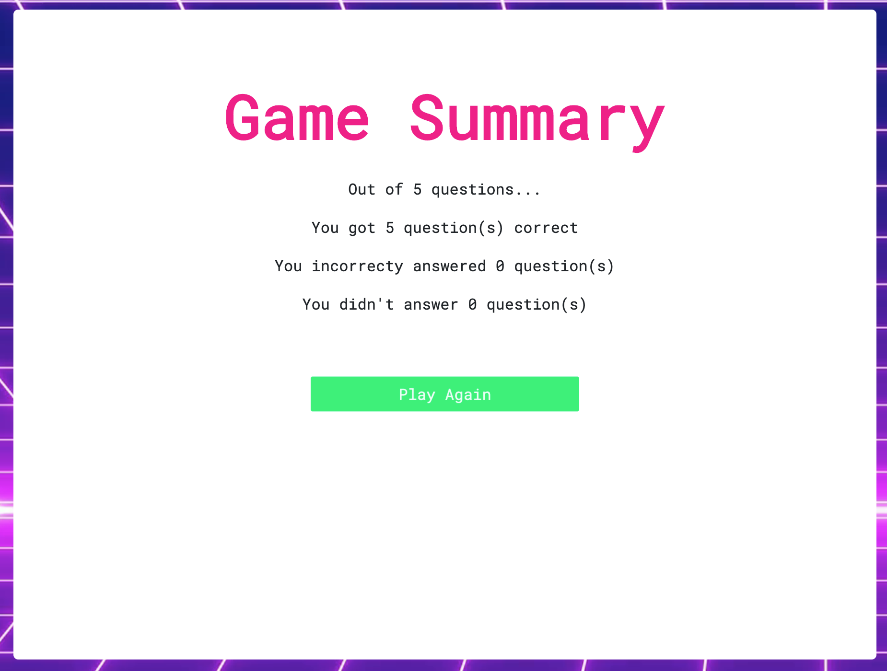

# Trivia Game

### [Link to App](https://matthewemichael.github.io/TriviaGame/index.html)

### Overview

In this assignment, I created a Trivia game using JavaScript for the logic and jQuery to manipulate HTML. This app is laid out with valid HTML and stylish CSS.

### Requirements

* App must suit these basic specs:
  * Create a trivia game that shows only one question until the player answers it or their time runs out.
  * If the player selects the correct answer, show a screen congratulating them for choosing the right option. After a few seconds, display the next question -- do this without user input.
  * The scenario is similar for wrong answers and time-outs.
    * If the player runs out of time, tell the player that time's up and display the correct answer. Wait a few seconds, then show the next question.
    * If the player chooses the wrong answer, tell the player they selected the wrong option and then display the correct answer. Wait a few seconds, then show the next question.
  * On the final screen, show the number of correct answers, incorrect answers, and an option to restart the game (without reloading the page).

### Additional Features

* Mobile-First Design

### Technologies Used
- [Bootstrap](https://getbootstrap.com/docs/4.0/getting-started/introduction/)
- [jQuery](https://www.jguery.com/)
- [animate.css](https://daneden.github.io/animate.css/)
- [Google Fonts](https://fonts.google.com/)
### Screen Shot

